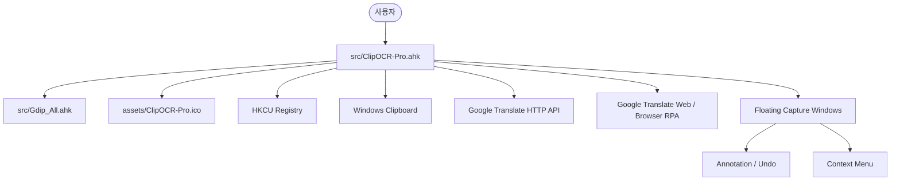

# AI_CODE_MAP.md

> **[AI 에이전트 주의사항]**
>
> 이 파일은 ClipOCR-Pro 프로젝트의 구조, 공개 대상, 보안 주의사항, 핵심 로직을 빠르게 파악하기 위한 코드 지도이다.
>
> 실제 최종 기준은 소스 코드이며, 코드를 수정하기 전에는 반드시 `myAGENT.md`와 이 파일을 먼저 확인한다.
>
> 잦은 문서 변경을 줄이기 위해 정확한 라인 번호 대신 파일명, 함수명, 전역 변수명, 검색 키워드 중심으로 기록한다.

---

## 1. 프로젝트 개요

| 항목 | 내용 |
| --- | --- |
| 프로젝트명 | ClipOCR-Pro |
| 목적 | Windows 화면 영역 캡처, 플로팅 참고 이미지, 주석 표시, 선택 텍스트 번역, 이미지 번역 업무 자동화 |
| 주요 사용자 | 재무, 회계, 정산, 영업관리 등 백오피스 실무자 |
| 사용 언어 | AutoHotkey v2 |
| 실행 진입점 | `src/ClipOCR-Pro.ahk` |
| 핵심 라이브러리 | `src/Gdip_All.ahk` |
| 설정 저장 위치 | `HKCU\Software\ScreenClipTool` |
| 공개 배포 방식 | 소스는 GitHub 저장소, 실행 파일과 ZIP은 GitHub Releases 권장 |

---

## 2. 폴더 분류

| Path | 분류 | GitHub 업로드 기준 | 설명 |
| --- | --- | --- | --- |
| `src/` | 소스 코드 | 포함 | AutoHotkey v2 메인 스크립트와 GDI+ 라이브러리 |
| `assets/` | 공개 자산 | 포함 | README 이미지, 앱 아이콘, 보조 이미지 |
| `release/` | 릴리즈 산출물 | 저장소 제외 | 기존 exe/zip 보관 위치, GitHub Releases 업로드 후보 |
| `tools/` | 작업용 도구 | 저장소 제외 | GIF 제작/분석 스크립트와 작업 산출물, 일부 절대 경로 포함 |
| `.vscode/` | 개인 편집기 설정 | 저장소 제외 | 개인 로컬 설정 |
| 루트 문서 | 문서/정책 | 포함 | README, LICENSE, `myAGENT.md`, `AI_CODE_MAP.md`, `.gitignore` |

---

## 3. GitHub 공개 기준

### 공개 저장소 포함 권장

```text
.gitignore
AI_CODE_MAP.md
LICENSE
README.md
README.ko.md
myAGENT.md
src/ClipOCR-Pro.ahk
src/Gdip_All.ahk
assets/ClipOCR-Pro.ico
assets/demo.gif
assets/manual.png
assets/github_icon.png
```

| Path | 역할 | 공개 메모 |
| --- | --- | --- |
| `src/ClipOCR-Pro.ahk` | 메인 AutoHotkey v2 소스 | 주석은 영어, 변수/함수명은 기존 영어 식별자 유지 |
| `src/Gdip_All.ahk` | GDI+ 래퍼 라이브러리 | 외부 의존성으로 원본 보존 우선, 임의 번역/리팩토링 금지 |
| `assets/ClipOCR-Pro.ico` | 앱 아이콘 | 16/24/32/48/64/128/256 멀티사이즈 ICO, Ahk2Exe 실행 파일 아이콘으로 포함 |
| `assets/demo.gif` | README 데모 이미지 | 공개 전 대표 프레임에 민감정보가 없는지 확인 |
| `assets/manual.png` | README 매뉴얼 인포그래픽 | 주요 기능과 단축키를 한 장으로 요약 |
| `assets/github_icon.png` | 보조 이미지 자산 | 현재 런타임 필수 파일은 아니며 자산 폴더로 분류 |

### 저장소 제외 권장

| Path | 제외 사유 | 처리 기준 |
| --- | --- | --- |
| `release/ClipOCR-Pro.exe` | 컴파일 산출물 | 저장소 대신 GitHub Releases 권장 |
| `release/ClipOCR-Pro.zip` | 배포 압축 산출물 | 저장소 대신 GitHub Releases 권장 |
| `dist/`, `build/`, `out/` | 빌드 산출물 | `.gitignore`로 제외 |
| `.vscode/` | 개인 편집기 설정 | 공개 저장소 추적 제외 |
| `tools/` | GIF 제작/분석 작업 파일 | 사용자 프로필 절대 경로가 포함되어 공개 제외 |

주의:

* `.gitignore`는 Git 클라이언트 사용 시 추적 제외에 도움을 주지만, GitHub 웹 직접 업로드에서는 자동 필터처럼 동작하지 않을 수 있다.
* 회사 PC 보안 규정 때문에 웹 업로드를 직접 수행할 경우, 포함/제외 목록을 수동으로 대조한다.

---

## 4. 실행 구조



기본 흐름:

1. 사용자가 단축키 또는 메뉴로 캡처, 번역, 정렬, 저장 작업을 실행한다.
2. `src/ClipOCR-Pro.ahk`가 화면 좌표, 클립보드, Registry, GUI 상태를 관리한다.
3. 화면 캡처와 이미지 처리는 `src/Gdip_All.ahk`의 GDI+ helper를 사용한다.
4. 소스 실행 시 아이콘은 `assets/ClipOCR-Pro.ico`를 참조한다.
5. 컴파일 실행 시 트레이 아이콘은 exe 내장 아이콘을 우선 사용한다.
6. 텍스트 번역은 Google Translate HTTP endpoint를 호출한다.
7. 이미지 번역은 브라우저를 열고 클립보드 이미지를 붙여넣는 RPA 방식으로 처리한다.

---

## 5. 핵심 파일과 기능 위치

| 기능 | 파일 | 주요 함수 / 검색 키워드 | 주의사항 |
| --- | --- | --- | --- |
| 화면 영역 캡처 | `src/ClipOCR-Pro.ahk` | `ScreenClip2Win`, `SelectArea` | DPI와 멀티 모니터 좌표계 유지 |
| 플로팅 캡처 창 | `src/ClipOCR-Pro.ahk` | `CreateClipWin`, `ClipWins` | 창 상태는 `HWND` 기반 `Map`에 저장 |
| 주석 그리기 | `src/ClipOCR-Pro.ahk` | `SCW_ApplyAnnotation`, `WM_LBUTTONDOWN`, `DrawRectPreview` | UndoStack과 GDI+ 포인터 해제 필요 |
| Undo | `src/ClipOCR-Pro.ahk` | `SCW_Undo` | 버려지는 비트맵 포인터 해제 필요 |
| 선택 텍스트 번역 | `src/ClipOCR-Pro.ahk` | `TranslateSelectedText`, `TranslateTextViaGoogle` | 외부 번역 서비스 전송 주의 |
| 번역 응답 파싱 | `src/ClipOCR-Pro.ahk` | `ParseGoogleTranslateResponse` | Google 응답 구조 변경 가능성 있음 |
| 번역 팝업 | `src/ClipOCR-Pro.ahk` | `ShowTextTranslationPopup`, `GetPopupPositionNearMouse` | AlwaysOnTop 및 화면 밖 표시 주의 |
| 이미지 번역 | `src/ClipOCR-Pro.ahk` | `GoogleImageTranslate`, `AutoPasteToGoogleTranslate` | 브라우저 포커스와 웹 UI 변경에 취약 |
| 설정창 | `src/ClipOCR-Pro.ahk` | `ShowDashboardDialog`, `SaveDashboardSettings` | Registry 호환성 유지 |
| 매뉴얼 창 | `src/ClipOCR-Pro.ahk` | `ShowManualDialog`, `GetManualText` | 다국어 텍스트 문자열은 기능 문구이므로 주석 정책과 별개 |
| GDI+ helper | `src/Gdip_All.ahk` | `Gdip_Startup`, `Gdip_BitmapFromScreen`, `Gdip_DisposeImage` | 외부 라이브러리 원본성 유지 |

---

## 6. 전역 변수와 설정

| 이름 | 용도 | 주의사항 |
| --- | --- | --- |
| `APP_NAME`, `APP_VERSION` | 앱 표시명과 버전 | README/릴리즈 표기와 맞춰 관리 |
| `APP_ICON_PATH` | 실행 중 사용할 아이콘 경로 | 컴파일 실행 시 `A_ScriptFullPath`, 소스 실행 시 `src/../assets/ClipOCR-Pro.ico` |
| `APP_SOURCE_ICON_PATH` | 소스 실행 fallback 아이콘 경로 | `assets/ClipOCR-Pro.ico` 이동 시 함께 수정 필요 |
| `REG_PATH` | 사용자 설정 Registry 경로 | 기존 사용자 설정 호환성을 위해 변경 금지 |
| `CLIP_SCALE` | 클립보드 이미지 복사/저장 스케일 | 설정창 및 메뉴와 연동 |
| `TEXT_TRANSLATE_LANG` | 선택 텍스트 번역 기본 언어 | `TranslateLang` Registry value 사용 |
| `TEXT_TRANSLATE_HOTKEY` | 선택 텍스트 번역 단축키 | `Win+CapsLock`은 정적 기본 단축키로 유지 |
| `TEXT_TRANSLATE_FONT_SIZE` | 번역 팝업 글자 크기 | 실사용 범위로 정규화 |
| `IMAGE_TRANSLATE_LANGS` | 이미지 번역 메뉴 언어 목록 | 콤마 구분 문자열로 저장 |
| `ClipWins` | 플로팅 캡처 창 상태 저장 | Key는 `HWND`, Value는 상태 object |
| `RightClickedHwnd` | 우클릭 메뉴 대상 창 | 메뉴 핸들러에서 대상 확인 |
| `TextTranslatePopupHwnd` | 현재 번역 팝업 HWND | 새 팝업 표시 전 기존 팝업 정리 |
| `DashboardHwnd`, `ManualHwnd` | 설정창/매뉴얼 창 중복 방지 | 창 종료 시 0으로 복구 |
| `TEMP_FILES` | 앱이 생성한 임시 파일 목록 | 종료 시 앱 소유 파일만 삭제 |
| `ENABLE_BMC_AUTO_DOWNLOAD` | 후원 버튼 이미지 자동 다운로드 제어 | 회사망 보안 기준으로 기본 `false` |

`ClipWins[hwnd]` 주요 상태 key:

| Key | 의미 |
| --- | --- |
| `pBitmap` | 캡처 이미지 GDI+ 비트맵 포인터 |
| `w`, `h` | 원본 이미지 크기 |
| `gui`, `picCtrl` | AHK GUI와 이미지 컨트롤 |
| `IsMinimized`, `id`, `NumText`, `NumBg` | 미니 모드 표시 상태 |
| `UndoStack` | 주석 Undo용 비트맵 포인터 스택 |
| `orgX`, `orgY` | 최소화 전 위치 |

---

## 7. 빌드 / 릴리즈 기준

개발 실행:

```powershell
& "C:\Program Files\AutoHotkey\v2\AutoHotkey64.exe" .\src\ClipOCR-Pro.ahk
```

컴파일 예시:

```powershell
& "C:\Program Files\AutoHotkey\Compiler\Ahk2Exe.exe" /in .\src\ClipOCR-Pro.ahk /out .\release\ClipOCR-Pro.exe /icon .\assets\ClipOCR-Pro.ico /base "C:\Program Files\AutoHotkey\v2\AutoHotkey64.exe"
```

릴리즈 기준:

* `release/`는 로컬 산출물 보관 위치이며 저장소 업로드 대상이 아니다.
* GitHub Releases에 업로드할 exe/zip은 빌드 후 해시와 아이콘, 실행 여부를 별도로 확인한다.
* 기존 `release/ClipOCR-Pro.exe`와 `release/ClipOCR-Pro.zip`은 루트에서 이동한 기존 산출물이며, 새 아이콘 반영 여부는 재컴파일 전까지 보장하지 않는다.

---

## 8. 외부 링크와 네트워크 동작

| 위치 | URL / 동작 | 공개/보안 메모 |
| --- | --- | --- |
| README | GitHub Releases 링크 | 공개 저장소 주소로 유지 |
| README | Buy Me a Coffee 링크 | 사용자가 공개 유지 선택 |
| About 화면 | GitHub profile 링크 | 사용자가 공개 유지 선택 |
| About 화면 | Buy Me a Coffee 링크 | 사용자가 공개 유지 선택 |
| 앱 실행 중 | Google favicon 다운로드 | GitHub 아이콘 표시 목적, 실패해도 기본 링크 표시 |
| 앱 설정 | BMC 버튼 다운로드 | `ENABLE_BMC_AUTO_DOWNLOAD := false`로 기본 비활성 |
| 텍스트 번역 | `translate.googleapis.com` | 선택 텍스트가 외부 서비스로 전송될 수 있음 |
| 이미지 번역 | `translate.google.com` | 캡처 이미지가 외부 서비스로 전송될 수 있음 |

민감한 회사 문서, 개인정보, 비밀번호, API key, 계좌/카드 정보, 내부 시스템 화면은 번역 기능 사용 전에 사용자가 직접 확인해야 한다.

---

## 9. 보안 점검 결과와 공개 전 체크리스트

현재 점검 기준:

* 텍스트 파일 대상: `.ahk`, `.md`, `.py`, `.html`, `.txt`, `.json`, `.gitignore`
* 검색 패턴: 사용자 프로필 절대 경로, 로컬 file URL, 네트워크 공유 경로, `password`, `token`, `secret`, `api_key`, `authorization`, `bearer`, private key, 개인정보 키워드
* 이미지 대상: `assets/demo.gif`, `assets/manual.png`, `assets/github_icon.png`, `tools/Manual1.png`, `tools/*.gif` 대표 프레임과 메타데이터

확인된 사항:

* `tools/` 하위 Python 작업 파일에는 사용자 프로필 절대 경로가 하드코딩되어 있으므로 공개 저장소에서 제외한다.
* `release/` 하위 exe/zip은 컴파일/배포 산출물이므로 저장소가 아니라 GitHub Releases 업로드 대상으로 분리한다.
* README와 About 화면의 GitHub/후원 링크, `LICENSE` 저작권 표기는 사용자가 공개 유지하기로 결정했다.
* `README.md`와 `README.ko.md`는 현재 `assets/demo.gif`와 `assets/manual.png`를 참조한다.
* `assets/ClipOCR-Pro.ico`는 멀티사이즈 ICO로 관리한다.

---

## 10. 변경 시 주의사항

* `REG_PATH`와 Registry value name은 기존 사용자 설정 호환성 때문에 변경하지 않는다.
* AutoHotkey v2 문법만 사용하고 v1 문법을 섞지 않는다.
* `src/Gdip_All.ahk`는 외부 라이브러리로 보고 원본성, 라이선스, 호환성을 우선한다.
* `pBitmap`, `pGraphics`, `pPen`, `pBrush`, `hBitmap` 등 GDI+ 리소스는 생성 후 해제 경로를 확인한다.
* 클립보드 백업/복구 실패는 사용자 데이터 손상으로 이어질 수 있으므로 안전 fallback을 유지한다.
* AlwaysOnTop 캡처 창은 InputBox, MsgBox, 브라우저 RPA, 설정창과 Z-order 충돌이 날 수 있다.
* Google Translate API와 Web UI는 외부 서비스라 응답 구조, 타이틀, 붙여넣기 동작이 바뀔 수 있다.
* 주석은 영어로 작성하되, 사용자에게 보여주는 UI 문구와 매뉴얼 본문은 다국어 문자열을 유지할 수 있다.

---

## 11. 변경 이력

| Date | Change | Updated By |
| --- | --- | --- |
| 2026-06-14 | 루트 파일을 `src/`, `assets/`, `release/`로 분류하고 경로/문서 갱신 | AI Agent |
| 2026-06-14 | `ClipOCR-Pro.ico` 멀티사이즈 재생성, 컴파일된 exe 내장 아이콘 우선 사용 로직 반영 | AI Agent |
| 2026-06-14 | `manual.png` 공개용 매뉴얼 인포그래픽 생성 및 README 참조 반영 | AI Agent |
| 2026-06-14 | GitHub 소스 중심 공개 기준, 제외 파일, 보안 점검 결과, 영어 주석/식별자 원칙 반영 | AI Agent |
