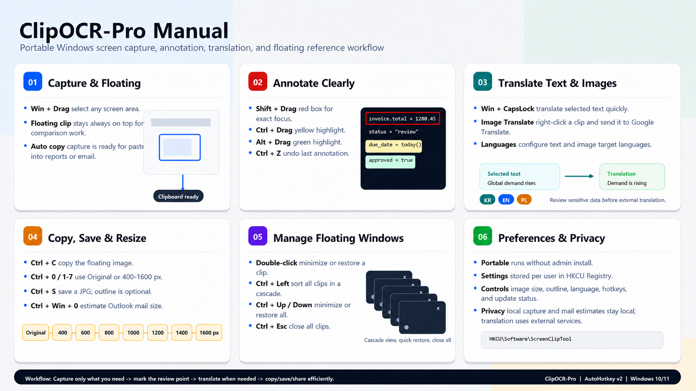

*다른 언어로 읽기: [English](README.md), [한국어](README.ko.md)*

# 📸 ClipOCR-Pro 화면 캡처 및 번역 업무 자동화 도구
AutoHotkey v2 기반의 포터블 화면 캡처, OCR, 선택 텍스트 번역, 이미지 업무 처리 도구입니다.

<p align="center">
  
</p>

---

## ClipOCR-Pro는 무엇을 하나요?

**ClipOCR-Pro**는 화면 일부를 빠르게 캡처하고, 캡처 이미지를 항상 위에 띄우며, 주석 표시, 선택 텍스트 번역, 이미지 번역, 문서 검토 업무를 지원하는 실무형 자동화 도구입니다.

재무, 회계, 채권, 영업관리, 백오피스 조직처럼 ERP 화면, Excel 파일, 이메일, 스캔 문서, 증빙 이미지, 스크린샷을 자주 비교·검토하는 팀에 특히 적합합니다.

> **빠른 캡처 · 명확한 문서 검토 · 선택 텍스트 번역 · 반복 화면 작업 축소**

---

## 핵심 기능 요약

- **📸 화면 영역 캡처**: 원하는 화면 영역을 단축키로 캡처하고 항상 위에 떠 있는 참고 이미지로 활용합니다.
- **🖍️ 빠른 주석 표시**: 캡처 이미지에 박스, 형광펜, 강조 표시를 추가해 검토 포인트를 명확히 표시합니다.
- **🌐 선택 텍스트 번역**: 선택한 텍스트를 설정된 번역 워크플로우로 빠르게 번역합니다.
- **🖼️ 이미지 번역 워크플로우**: 메일 첨부 이미지, 스캔 문서, 해외 증빙을 Google 이미지 번역 방식으로 확인할 수 있습니다.
- **📐 이미지 리사이즈 및 복사**: 캡처 이미지를 설정한 가로 400~1600px에 맞춘 뒤 문서, 이메일, 보고서에 붙여 넣을 수 있습니다.
- **📧 Outlook 웹메일 용량 추정**: 작성 본문의 클립보드 데이터에 제목·헤더·인코딩 여유분을 더해 첨부 제외 예상 크기를 MB로 표시합니다.
- **🖥️ 다중 모니터 지원**: 여러 모니터를 사용하는 사무 환경에서도 캡처와 플로팅 창을 활용할 수 있습니다.

---

## 🚀 다운로드 및 실행 방법

**ClipOCR-Pro**는 별도 설치 없이 실행 파일을 더블 클릭하여 사용하는 **무설치 포터블 프로그램**입니다.

### 📥 일반 팀원용 원클릭 다운로드

1. 깃허브 화면 우측의 **[Releases](https://github.com/KwangBeomPark/ClipOCR-Pro/releases)** 탭으로 이동합니다.
2. 최신 릴리즈의 **`ClipOCR-Pro.zip`** 또는 **`ClipOCR-Pro.exe`** 단독 실행 파일을 다운로드합니다.
3. 필요한 경우 압축을 풀고 **`ClipOCR-Pro.exe`**를 더블 클릭합니다.
4. Windows 시스템 트레이에 아이콘이 표시되면 바로 사용할 수 있습니다.

아직 릴리즈 파일이 등록되지 않은 경우, AutoHotkey v2로 소스 코드를 직접 실행하거나 빌드해 주세요.

### 🛠️ 파워 유저 및 개발자용 커스텀 빌드

1. [AutoHotkey v2](https://www.autohotkey.com/)를 설치합니다.
2. 이 저장소를 Clone합니다.
3. `src/ClipOCR-Pro.ahk` 소스 코드를 필요에 맞게 수정합니다.
4. Ahk2Exe로 본인만의 `ClipOCR-Pro.exe`를 패키징합니다. 저장소의 `assets/ClipOCR-Pro.ico`는 Ahk2Exe 지시문을 통해 실행 파일 아이콘으로 포함됩니다.

---

## 💼 실제 업무 활용 예시

- **정산 및 증빙 검토**: Invoice, ERP 화면, Excel 자료, 증빙 파일의 핵심 영역을 캡처해 승인자가 빠르게 확인할 수 있게 합니다.
- **해외 메일 및 문서 번역**: 외국어 메일, 첨부 이미지, 스캔 문서에서 선택 텍스트 번역 또는 이미지 번역을 활용합니다.
- **다중 자료 비교**: ERP, Excel, 이메일, 스크린샷, 증빙 문서를 동시에 띄워 정산·검토·대사 업무에 활용합니다.
- **보고서 작성 보조**: 참고 이미지를 항상 위에 띄운 상태로 보고서, 이메일, 내부 설명 자료를 작성합니다.
- **회의 및 교육 자료 설명**: 매뉴얼 일부를 캡처하고, 주석을 표시한 뒤 최소화/복원하면서 업무 절차를 설명합니다.
- **이메일 첨부 최적화**: 캡처 이미지를 리사이즈한 뒤 이메일이나 문서에 붙여 넣어 파일 용량과 가독성을 관리합니다.

---

## 📖 사용자 매뉴얼

<p align="center">
  
</p>

✔ **Capture Window**: 선택한 화면 영역을 캡처하고 항상 위에 떠 있는 이미지로 유지  
✔ **Annotation**: 박스, 형광펜, 강조 표시 등 간단한 시각적 주석 추가  
✔ **Translation**: 선택 텍스트 번역 및 외국어 이미지 번역 워크플로우 활용  
✔ **Copy / Save / Resize**: 앱 설정값에 따라 캡처 이미지를 복사, 저장, 리사이즈  
✔ **Window Management**: 단축키로 플로팅 창 최소화, 복원, 정렬, 크기 조정, 전체 닫기 수행

> 선택 텍스트 번역과 이미지 번역은 Google 번역 서비스를 사용하므로, 민감한 회사 정보나 개인정보는 전송 전에 확인해 주세요.

---

## ⌨️ 주요 단축키

| 단축키 | 기능 |
|--------|------|
| `Win + Drag` | 화면 영역 캡처 후 항상 위에 플로팅 |
| `Win + CapsLock` | 선택한 텍스트를 설정된 Google 번역 워크플로우로 번역 |
| Outlook 웹메일 본문에서 `Ctrl + Win + 0` | 본문과 제목·헤더를 포함한 첨부 제외 보수적 예상 크기를 MB로 표시 |
| 플로팅 창에서 마우스 오른쪽 클릭 | 이미지 번역, 주석, 복사/저장, 창 관리 메뉴 열기 |
| 플로팅 창에서 더블 클릭 | 플로팅 이미지 최소화 또는 복원 |
| 플로팅 창에서 `Ctrl + C` | 플로팅 이미지 복사 |
| 플로팅 창에서 `Ctrl + 0` | Original Size를 기본값으로 저장하고 현재 이미지를 원본 크기로 즉시 복사 |
| 플로팅 창에서 `Ctrl + 1`~`Ctrl + 7` | 가로 400~1600px로 설정하고 현재 이미지를 즉시 복사 |
| 플로팅 창에서 `Ctrl + S` | 현재 가로폭·아웃라인 설정을 적용해 바탕화면에 JPG 저장 |
| 플로팅 창에서 `Shift + Drag`, `Ctrl + Drag`, `Alt + Drag`, `Ctrl + Z` | 빨간 박스, 노란 형광펜, 초록 형광펜, 실행 취소 |
| 플로팅 창에서 `Ctrl + ↑`, `Ctrl + ↓`, `Ctrl + ←`, `Ctrl + Esc` | 최소화, 원래 크기, 왼쪽 정렬, 전체 닫기 |

---

## ⚙️ 설정 저장 방식

ClipOCR-Pro 설정값은 Windows 사용자별 Registry에 저장됩니다.

```text
HKCU\Software\ScreenClipTool
```

현재 저장되는 주요 값은 클립보드 이미지 크기(Original Size 또는 가로 400~1600px), 복사/저장 이미지 아웃라인 여부, 선택 텍스트 번역 언어, 번역 단축키, 이미지 번역 메뉴 언어입니다. 클립보드에는 호환성이 높은 Windows 비트맵으로 복사되며, 툴팁의 용량은 JPG 품질 85로 저장할 경우의 예상값입니다.

설정창 About 탭을 열면 GitHub 최신 릴리즈를 확인합니다. 새 버전이 있을 때만 `View Update` 버튼이 활성화되며, 버튼은 다운로드나 설치를 수행하지 않고 해당 GitHub Release 페이지를 브라우저로 엽니다.

권장 포터블 배포 구조는 아래처럼 단순하게 유지합니다.

```text
ClipOCR-Pro.exe
```

팀 단위로 같은 설정을 배포해야 하는 경우에는 위 Registry 경로의 값을 별도로 내보내 공유하는 방식을 사용하면 됩니다.

---

## 🔐 보안 및 개인정보

- ClipOCR-Pro는 Windows 로컬 환경에서 실행됩니다.
- 로컬 캡처, 주석 표시, 복사, 저장, 리사이즈 기능은 사용자 PC에서 처리됩니다.
- Outlook 웹메일 용량 추정은 로컬 클립보드에서만 계산하며 메일 내용을 외부로 전송하지 않습니다. 실제 발송 크기와는 차이가 있을 수 있습니다.
- 번역 기능을 사용할 경우, 설정된 방식에 따라 선택 텍스트나 이미지가 Google Translate 등 외부 번역 서비스에서 처리될 수 있습니다.
- 비밀번호, API Key, 개인 인증정보, 민감한 재무 데이터, 고도의 기밀 문서는 외부 번역 서비스에 입력하지 않는 것을 권장합니다.
- 회사 정책상 Registry 배포를 사용할 경우, 배포 전에 업무 특화 설정이나 민감한 값이 포함되어 있는지 검토하세요.

---

## 👨‍💼 개발 배경

저는 **전문 개발자가 아니라, 재무 부서에서 실제 업무를 수행하는 실무자**입니다.

반복적인 화면 캡처, 선택 텍스트 번역, 문서 정리, 정보 공유 업무를 줄이기 위해 이 프로젝트를 시작했습니다. 작은 자동화 스크립트로 출발했지만, 실제 업무 흐름에 맞춰 점차 실무 중심 생산성 도구로 발전했습니다.

ClipOCR-Pro는 반복 업무를 직접 찾아내고, 실무 병목을 자동화하며, 비개발자도 쉽게 사용할 수 있도록 만드는 것을 목표로 합니다.

---

## 💻 환경 및 라이선스

- **지원 환경**: Windows 10 / 11, AutoHotkey v2 실행 환경 또는 컴파일된 단독 실행 파일
- **macOS**: 미지원
- **라이선스**: MIT License. GDI+ wrapper by Tariq Porter (tic)을 포함합니다.

---

## ☕ 커피 한잔으로 응원하기

이 도구가 반복 업무를 줄이거나 업무 효율 향상에 도움이 되었다면, 보내주시는 응원은 더 실용적인 오피스 자동화 도구를 만드는 데 큰 힘이 됩니다.

<p align="center">
  <a href="https://www.buymeacoffee.com/KBPark_Bob">
    
  </a>
</p>
