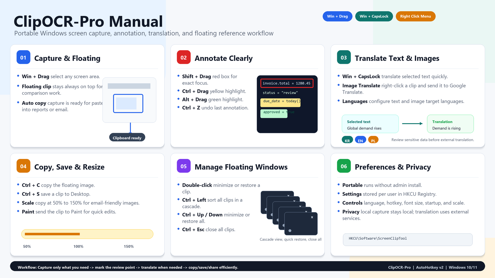

*Read this in other languages: [English](README.md), [한국어](README.ko.md)*

# 📸 ClipOCR-Pro: Office Screen Capture, OCR & Translation Tool
A portable screen capture, OCR, selected-text translation, and image workflow tool for practical office work, built with AutoHotkey v2.

<p align="center">
  
</p>

---

## What ClipOCR-Pro Does

**ClipOCR-Pro** helps office professionals capture screen areas, keep reference images floating on top, annotate captured images, translate selected text, and streamline document review workflows.

It is designed especially for finance, accounting, sales administration, credit control, and back-office teams that frequently compare ERP data, Excel files, emails, scanned documents, screenshots, and supporting evidence.

> **Capture Faster · Review Documents Clearly · Translate Selected Text · Reduce Repetitive Screen Work**

---

## Core Features

- **📸 Screen Area Capture**: Capture any selected area with a hotkey and keep it as a floating always-on-top reference window.
- **🖍️ Quick Annotation**: Mark captured images with red boxes, highlights, and simple visual notes during review.
- **🌐 Selected Text Translation**: Translate selected text using the configured translation workflow.
- **🖼️ Image Translation Workflow**: Send captured images to Google Image Translation when needed for email attachments, scanned documents, and overseas evidence.
- **📐 Image Resize & Copy**: Resize captured images based on app settings before copying or pasting into documents, emails, or reports.
- **🖥️ Multi-Monitor Support**: Use capture and floating windows across multi-monitor office environments.

---

## 🚀 Download & Quick Start

**ClipOCR-Pro** is a **portable application**. It runs by double-clicking the executable and does not require a complex installation process.

### 📥 For General Users (One-Click Portable Download)

1. Go to the **[Releases](https://github.com/KwangBeomPark/ClipOCR-Pro/releases)** tab on the right side of the GitHub repository.
2. Download the latest **`ClipOCR-Pro.zip`** or standalone **`ClipOCR-Pro.exe`** file.
3. Unzip the file if needed, then double-click **`ClipOCR-Pro.exe`**.
4. An icon will appear in the Windows system tray, and ClipOCR-Pro is ready to use.

If no release file is available yet, please build or run the source using AutoHotkey v2.

### 🛠️ For Power Users & Developers (Custom Build)

1. Install [AutoHotkey v2](https://www.autohotkey.com/).
2. Clone this repository.
3. Customize `src/ClipOCR-Pro.ahk` as needed.
4. Use Ahk2Exe to package your own `ClipOCR-Pro.exe`. The source includes `assets/ClipOCR-Pro.ico`, and the Ahk2Exe directive embeds it as the executable icon.

---

## 💼 Practical Business Use Cases

- **Settlement and supporting document review**: Capture key areas from invoices, ERP screens, Excel sheets, and evidence files so approvers can verify details quickly.
- **Overseas email and document translation**: Translate selected text or use image translation for foreign-language attachments and scanned documents.
- **Multi-source comparison**: Keep ERP, Excel, emails, screenshots, and supporting documents visible at the same time for reconciliation or review.
- **Report preparation**: Keep reference images floating on top while drafting reports, emails, or internal explanations.
- **Meetings and training**: Capture a part of a manual, annotate it, minimize/restore it, and explain the process clearly.
- **Email attachment optimization**: Resize captured images before pasting them into emails or documents to reduce file size and improve readability.

---

## 📖 User Guide

<p align="center">
  
</p>

✔ **Capture Window**: Capture a selected screen area and keep it as an always-on-top floating image.  
✔ **Annotation**: Add red boxes, highlights, and quick visual emphasis to captured images.  
✔ **Translation**: Translate selected text or use image translation workflows when working with foreign-language documents.  
✔ **Copy / Save / Resize**: Copy, save, resize, or reuse captured images based on app settings.  
✔ **Window Management**: Minimize, restore, align, resize, or close floating capture windows using shortcuts.

> Selected text translation and image translation use Google Translate services, so review sensitive company or personal information before sending it.

---

## ⌨️ Main Shortcuts

| Shortcut | Function |
|---------|----------|
| `Win + Drag` | Capture a screen area and keep it floating on top |
| `Win + CapsLock` | Translate selected text using the configured Google Translate workflow |
| Right-click on floating window | Open image translation, annotation, copy/save, and window management menu |
| Double-click on floating window | Minimize or restore the floating image |
| `Ctrl + C` on floating window | Copy the floating image |
| `Shift + Drag`, `Ctrl + Drag`, `Alt + Drag`, `Ctrl + Z` on floating window | Red box, yellow highlight, green highlight, undo |
| `Ctrl + ↑`, `Ctrl + ↓`, `Ctrl + ←`, `Ctrl + Esc` on floating window | Minimize, restore original size, align left, close all |

---

## ⚙️ Settings Storage

ClipOCR-Pro stores per-user configuration data in the Windows Registry.

```text
HKCU\Software\ScreenClipTool
```

Current settings include clipboard image scale, selected-text translation language, translation hotkey, and image translation menu languages.

Recommended portable deployment structure:

```text
ClipOCR-Pro.exe
```

If a team needs shared defaults, export and distribute the values under the Registry path above according to company policy.

---

## 🔐 Security & Privacy

- ClipOCR-Pro runs locally on Windows.
- Local capture, annotation, copy, save, and resize actions are handled on the user's PC.
- When translation features are used, selected text or images may be processed through external translation services such as Google Translate, depending on the configured workflow.
- Avoid translating or storing passwords, API keys, personal credentials, confidential financial data, or highly sensitive documents through external services.
- Review exported Registry settings before distributing them to colleagues, especially if they contain workflow-specific values.

---

## 👨‍💼 Project Background

I am **not a professional developer, but a finance practitioner working with real business operations.**

I started this project to reduce repetitive office tasks such as screen capture, selected text translation, document organization, and information sharing. What began as a small automation script gradually evolved into a practical productivity tool for real office workflows.

ClipOCR-Pro reflects a hands-on approach: identify repetitive work, automate the practical pain points, and make the result simple enough for non-developers to use.

---

## 💻 Environment & License

- **Environment**: Windows 10 / 11, AutoHotkey v2 runtime, or compiled standalone executable
- **macOS**: Not supported
- **License**: MIT License. Includes GDI+ wrapper by Tariq Porter (tic).

---

## ☕ Support This Project

If this tool has helped reduce repetitive work or improved your productivity, your support is a great motivation for creating more practical office automation tools.

<p align="center">
  <a href="https://www.buymeacoffee.com/KBPark_Bob">
    
  </a>
</p>
