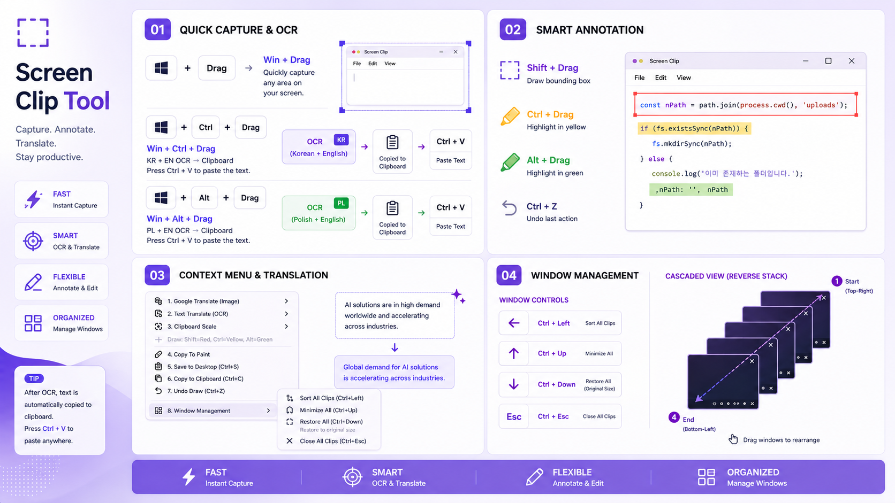

*Read this in other languages: [English](README.md), [한국어](README.Korean.md)*
# 📸 Practical Automation for Everyday Office Workflows  
(AI-Assisted ScreenClip Tool v1)

  

---

I’m **not a professional software engineer**, but a finance professional who started building automation tools to reduce repetitive tasks such as **screen capturing, OCR extraction, document organization, and information sharing**.

What began as a small automation script gradually evolved into a practical productivity tool designed for real-world office workflows.

> **Reducing repetitive work · Improving team productivity · Workflow automation · Solving practical problems**

This project was built with those goals in mind.

---

# 💼 Real-World Use Cases

- **Settlement & Supporting Document Review**  
  Highlight key information to help approvers quickly understand critical details.

- **Translation of Overseas Emails & Documents**  
  Use OCR or Google Image Translation for multilingual emails and supporting materials.

- **Multi-Source Comparison**  
  Compare ERP, Excel, emails, and supporting documents simultaneously using multiple floating windows.

- **Report Preparation**  
  Keep multiple references visible while preparing reports.

- **Meetings & Training Sessions**  
  Capture parts of manuals and explain cases using minimize/restore (double-click) functionality.

- **Image Text Extraction**  
  Read text instantly from email attachments, scanned documents, or screenshots.

- **Document Attachment Optimization**  
  Resize captured images based on application settings before pasting into reports or emails.

---

# 📖 User Guide

✔ Always-on-top floating screenshots, annotation tools, multi-monitor arrangement  
✔ Capture image → Paste directly into Google Translate browser (Korean / English / Polish)  
✔ OCR extraction, image resizing  

---

# ⌨️ Main Shortcuts

| Shortcut | Function |
|---------|------|
| `Win + Drag` | Capture screen and create an always-on-top floating window |
| `Win + Ctrl + Drag`, `Win + Alt + Drag` | Korean/English OCR, Polish/English OCR |
| `Mouse Right` on floating window | Open Google Translate image/text options |
| `Double Click` on floating window | Minimize / Restore |
| `Ctrl + C` on floating window | Copy floating image |
| `Shift + Drag`, `Ctrl + Drag`, `Alt + Drag`, `Ctrl + Z` | Red Box, Yellow Highlight, Green Highlight, Undo |
| `Ctrl + ↑`, `Ctrl + ↓`, `Ctrl + ←`, `Ctrl + Esc` | Minimize, Restore, Align Left, Close All |

---

# 🖥️ Environment & License

🖥️ **Supported Environment:** Windows 10 / 11 (Built on Windows OCR API)  
✘ **Not Supported:** macOS *(Maybe one day with Rust? 🙂)*

📄 **License:** MIT License  
GDI+ wrapper by Tariq Porter (tic)  
OCR wrapper by Descolada

---

## ☕ Support This Project

If this tool helps reduce repetitive work or improve your productivity,

your support will encourage me to continue building more practical automation tools for everyday workflows.

  

